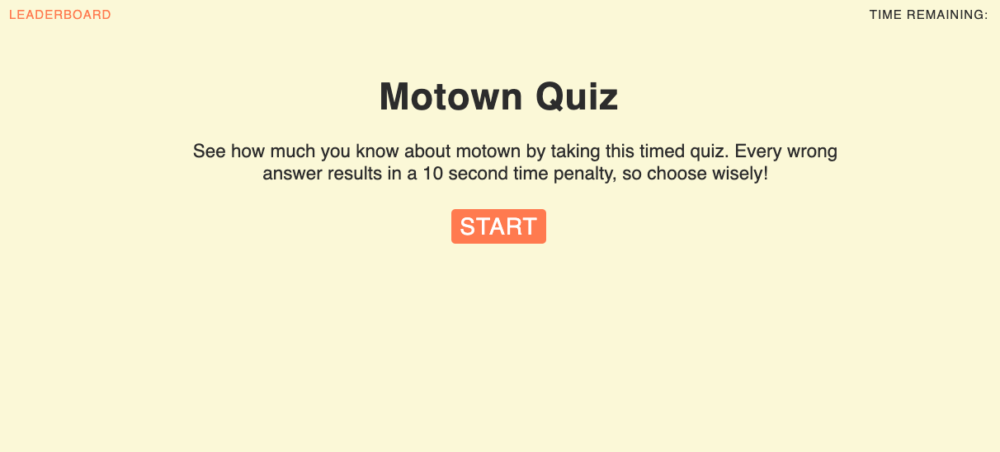

# Motown Quiz

Motown Quiz is a javascript-based web application enables built to test people's familiarity with a legendary music genre.

The underlying logic is Javascript-based, while leveraging dynamically updating HTML and CSS for a responsive user interface that adapts to multiple screen sizes.

## Deployed site
[Click here to visit deployed Motown Quiz application.](https://sahhollingsworth.github.io/motown-quiz/ "link to Motown Quiz web application")

## Summary
* 5 question timed quiz on motown knowledge.
* A user's score is the time remaining (seconds) upon quiz completion. The more time remaining, the better the score.
* There are 2 paths to completion:
  * Happy Path: User completes all questions before the alotted time.
  * Unhappy Path: Alotted time runs out before user is able to answer all questions.
* When a user clicks the start button, the timer starts and they are presented with a question.
* When a user answers a question they are immediately presented with another question.
* If a user answers a question incorrectly, then time is subtracted from the running timer.
* Regardless of path, once the quiz is complete the user can save their initials and score.
* The user can view a Leaderboard of all locally saved highscores at any point.
* The user can clear the Leaderboard of all locally saved highscores.

### UX Improvements to Explore in the Future
* Change visual properties of the Timer when less than 20 seconds remain.
  * User has a better understanding of quiz state.
* In the initials entry input, add keyup that triggers saveScore function.
  * User can user the enter key on keyboard to submit their initials & highscore.
* Opt out button in the end UI (initials entry) to opt out of saving high score.
  * Users who don't care about Leaderboard cannot skip that part of the flow if they want to retake the quiz.
* Add visual cues to text toast on answer select, all inline, before iterating to next question. If incorrect answer, possibly note correct answer choice unless desired outcome it for user to take quiz repeatedly
  * Much cleaner UI and quicker for user to understand while timer continues running. 
* Block negative scores, setting baseline of 0.

## Built with
* [HTML](https://developer.mozilla.org/en-US/docs/Web/HTML) - Used to create elements on the DOM
* [CSS](https://developer.mozilla.org/en-US/docs/Web/CSS) - Used to style html elements on the page
* [Javascript](https://developer.mozilla.org/en-US/docs/Web/javascript) - Used to for the user interaction and underlying password selection logic
* [Git](https://git-scm.com/doc) - Used for version control system to track changes to source code
* [GitHub](https://docs.github.com/en) - Hosts the code repository

## Authors
Sarah Hollingsworth
* [Github](https://github.com/sahhollingsworth)
* [LinkedIn](https://www.linkedin.com/in/sarahhollingsworth/)

## Acknowledgments
* Icons from [the Noun Project](https://thenounproject.com/)
* Reset.css in public domain, found at [Meyer Web](http://meyerweb.com/eric/tools/css/reset/)